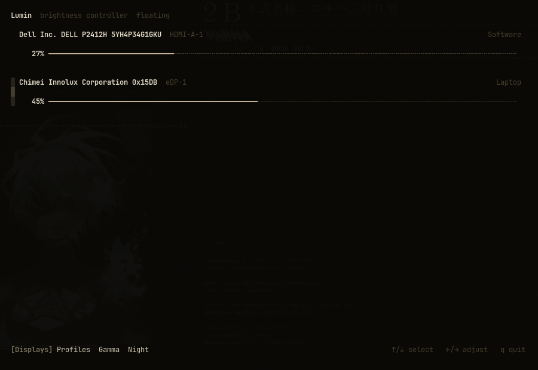

## lumin

A TUI brightness and display controller for Hyprland.

Controls laptop brightness, external monitors via DDC/CI, and falls back to a software dimming overlay when hardware brightness is unavailable. Settings persist across sessions.

The UI is inspired by [wiremix](https://github.com/tsowell/wiremix): dense rows, text sliders, mouse support, and a small footer menu.



## What works

- laptop brightness via `brightnessctl`
- external monitor brightness via `ddcutil` (DDC/CI)
- software overlay dimming fallback when DDC is unavailable
- automatic backend selection per monitor
- brightness persistence across sessions (`~/.config/lumin/lumin.toml`)
- keyboard and mouse brightness controls
- Hyprland floating window launch
- fallback notifications when DDC fails

## Controls

- `q`: quit
- `Esc`: close popup
- `Up` / `Down`: select display
- `Left` / `Right`: adjust brightness
- `1` / `2` / `3` / `4`: open footer sections
- mouse click/drag on a slider: set brightness

## Requirements

- Hyprland
- `hyprctl`
- `brightnessctl`
- `ddcutil`
- Ghostty or Alacritty for the floating TUI window

## Run

```bash
cargo run
```

On Hyprland, this opens lumin in a pinned floating terminal window.

The overlay helper is built as a second binary:

```bash
cargo check --bin lumin-overlay
```

## Config

Lumin saves brightness settings automatically on quit:

```
~/.config/lumin/lumin.toml
```

```toml
[[monitors]]
name = "eDP-1"
brightness = 75

[[monitors]]
name = "HDMI-A-1"
brightness = 50
preferred_backend = "Software"  # optional: force a backend
```

## Backend selection

For each monitor, Lumin picks a backend automatically:

| Monitor | Backend |
|---|---|
| `eDP*` | Laptop (`brightnessctl`) |
| `HDMI*` / `DP*` with working DDC | DDC (`ddcutil`) |
| Everything else | Software overlay |

If DDC fails during use, the monitor falls back to the software overlay immediately.

Set `preferred_backend` in the config to override automatic selection.

## Notes

DDC support is still rough. Some monitors do not respond reliably, especially through adapters, docks, KVMs, or older inputs.

The software backend uses a fullscreen layer-shell overlay. It dims visually; it does not change the monitor panel brightness.

The footer sections are a work in progress:

- **Displays** — backend info and switching (in progress)
- **Profiles** — named brightness presets (planned)
- **Gamma** — color temperature controls (planned)
- **Night** — night mode toggle and schedule (planned)

## Layout

```
src/
├── app.rs
├── brightness.rs
├── config.rs
├── software.rs
├── monitor.rs
├── main.rs
├── bin/lumin-overlay.rs
└── ui/
```
